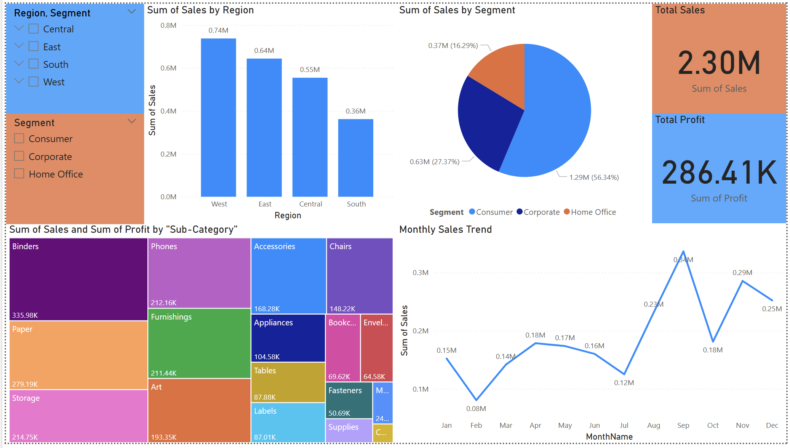
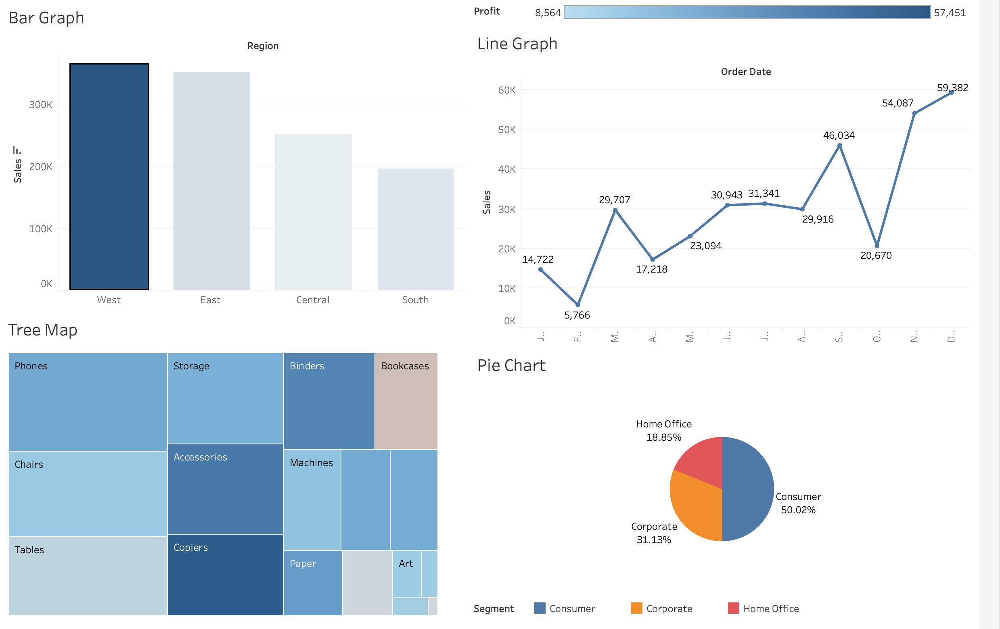

Sales Dashboard using SQL & Power BI**  

Project Summary:**  
This project analyzes Superstore sales data using **SQL** for data extraction, Excel for cleaning, and Power BI  for creating an interactive dashboard. It uncovers insights on regional performance, segment-wise sales, and product profitability to support data-driven decision-making.  

Dashboard Preview**  

Power BI Dashboard

Tableau Dashboard (Optional)

Objective
To generate actionable insights from sales data across **regions**, **segments**, and **product categories** using interactive visualizations.  

Project Workflow**  

1. SQL (SQLite) – Queried and filtered sales data using `.db` file.  
2. Excel – Cleaned and transformed the data (`Superstore_cleaned.csv`).  
3. Power BI – Created dashboard visuals, slicers, and calculated metrics using DAX.  
4. Dashboard – Final visuals: Bar chart, Pie chart, Tree Map, KPI cards, Monthly trends.  

Tools Used**  
- SQL (SQLite + DB Browser)– Data querying & extraction  
- Excel – Data cleaning & formatting  
- Power BI – Dashboard creation  
- Tableau (optional) – Alternative visualization  

Files Included**  

| File Name                          | Description |
|------------------------------------|-------------|
| `Superstore_Cleaned_Dataset.csv`   | Cleaned dataset used in Power BI |
| `Superstore_Sales_Database.db`     | SQLite database used for queries |
| `Superstore_Sales_DB_Browser_Project.sqbpro` | DB Browser project file |
| `Superstore_Sales_PowerBI.pbix`    | Final Power BI dashboard |
| `PowerBI_Dashboard_Screenshot.png` | Image preview of Power BI dashboard |
| `Tableau_Dashboard_Project.twb`    | Optional Tableau version of dashboard |
| `Tableau_Dashboard_Screenshot.png` | Tableau dashboard screenshot |

How to Run This Project**  

For SQL:
1. Download `Superstore_Sales_Database.db`  
2. Open in DB Browser for SQLite
3. Run your SQL queries to explore the data  

For Power BI:
1. Download `Superstore_Sales_PowerBI.pbix`  
2. Open in Power BI Desktop
3. Interact with slicers and visuals to explore insights  

For Tableau (Optional):
1. Download `Tableau_Dashboard_Project.twb`  
2. Open in **Tableau Desktop** to explore the alternative version  

Key Insights
- West Region leads in sales but not in profit  
- Consumer Segment dominates total sales  
- Binders & Phones generate highest revenue  
- September shows peak monthly sales  

GitHub Link
[View This Project on GitHub](https://github.com/CMVaishnav/Sales-Dashboard-SQL-PowerBI)
